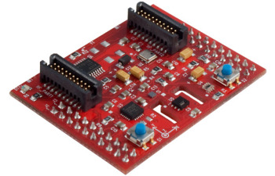
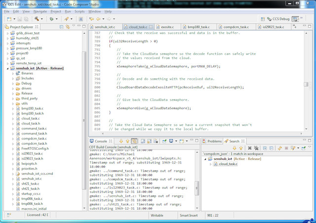
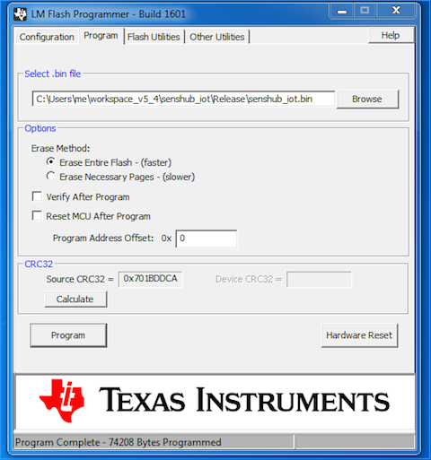
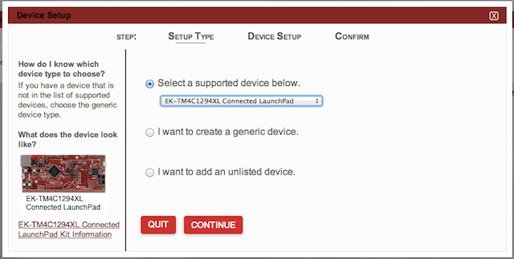
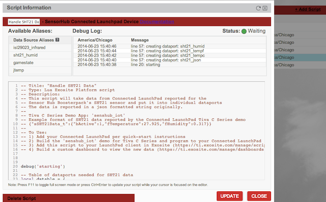
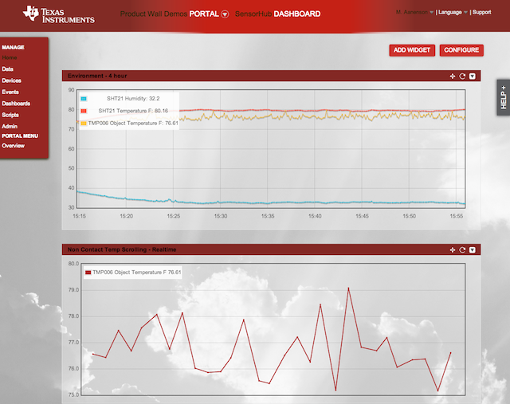

#Connected LaunchPad Sensor Hub 
=====================

##### Disclaimer
_The code for the SensorHub on the Connected LaunchPad was created by and supported by Texas Instruments.  Source is provide and customers can use as reference.  The following Exosite platform scripts are meant to be used as reference code and can be modified by users._  For TivaWare™ software support, use the [TI forums](http://e2e.ti.com/support/microcontrollers/tiva_arm/default.aspx):

## Overview
The Texas Instruments Connected LaunchPad is shipped with an Exosite IoT reference application that is a part of the out of box experience and usage on ti.exosite.com.  The actual Connected LaunchPad (CLP) has limited sensors on the board but TI has a number of 'Booster Packs' that can be used with it.  [http://www.ti.com/ww/en/launchpad/boosterpacks.html](http://www.ti.com/ww/en/launchpad/boosterpacks.html)

One of these is the Sensor Hub: [http://www.ti.com/tool/boostxl-senshub](http://www.ti.com/tool/boostxl-senshub)

Texas Instruments provides driver support for this board in the [TivaWare™ for C Series Driver Library](http://www.ti.com/tool/sw-tm4c-drl) and includes a project to build that will work on the Conencted LaunchPad and will send data from these sensors to Exosite.  The project is called **'senshub_iot'** and uses FreeRTOS.

This project sends data to specific 'dataports' for your virtual cloud device representing your Connected LaunchPad as JSON formated data.  To make this easier for users to try out, Exosite has created a number of Lua scripts that can be added to your cloud device instance that will create the appropriate dataports and handle incoming data which must be parsed (JSON format) and individually place into specific dataports.
Here is a table for the Exosite client dataports that the senshub_iot project application uses.

| Friendly Name          | Type   | Alias          |
|------------------------|--------|----------------|
| BMP180 Data            | string | bmp180_json    |
| Complimentary DCM Data | string | compdcm_json   |
| ISL29023 Data          | string | isl29023_json  |
| SHT21 Data             | string | sht21_json     |
| TMP006 Data            | string | tmp006_json    |
| Task Statistics        | string | taskstats_json |

## Lua Scripts

* Handle_SHT21_Data.lua - *Temperature, Humidity*
* Handle_TMP006_Data.lua - *Non-contact Temperature, Ambient Temperature*
* Handle_ISL29023_Data.lua - *Visible, Infared Light*
* Handle_BMP180_Data.lua - *Pressure, Altitude*
* Handle_CompDCM_Data.lua -  *9-axis MEMS data (create dataport only)*

###How to use

1. Install the TivaWare™ software along with Code Composer.  Build the 'senshub_iot' project and flash your board.  
	
2. **_OR_** Included with this project is a binary image (**senshub_iot.bin**) that was pre-built.  Use TI's LM Flash Programmer tool to flash this binary to your Connected LaunchPad.  
	
3. If you have not already, create an account on ti.exosite.com and add your Connected LaunchPad using 'Add Device'.  
[Getting started with Connected LaunchPad ](https://support.exosite.com/hc/en-us/articles/200778084-EK-TM4C1294XL-Connected-LaunchPad)  
	
4. Click the 'scripts' button on the left hand menu 'or' go to ti.exosite.com/manage/scripts.
5. For each of the included .lua scripts with this project, you need to add a script, give it a name, paste in the code and hit 'update'.  
	  

Now, if you click on your device (manage devices page), you'll see a number of new dataports created.  These dataports are available for creating custom dashboards, analyzing the data with Lua scripts, etc.  

Each script creates any dataports it knows are needed for the CLP to write data to or to use to store sensor data.  It then runs a while loop to wait for incoming data (JSON formatted strings), parse out individual values and store appropriately into individual data ports.

An example, data for the SHT21 Sensors is sent to a data port called **'sht21_json'**.  
An example value written to this dataport is **{"sSHT21Data_t":{"bActive":1,"fTemperature":27.925,"fHumidity":0.317}}**.

Feel free to modify these scripts for your own use.

####Example dashboard widget using some data collected
  

[Custom line graph widget code can be found here ](https://github.com/exosite-garage/custom_widget_scripts/tree/master/line_graphs)

## Notes
1. The senshub_iot app writes data to Exosite every 10 seconds
2. The dataports written to by senshub_iot app are:
	3. sht21_json - Temperature, Humidity
	4. bmp180_json - Pressure, Altitude
	5. isl29023_json - Visible, Infared Light 
	6. tmp006_json - Ambient Temperature, Non-contact Temperature
	7. compdcm_json - 9-axis MEMS data, Script only creates dataport, doesn't handle data  
	8. taskstats_json  - Currenlty no script is provided, add a dataport with alias 'taskstats_json' to see this data

	
	
	